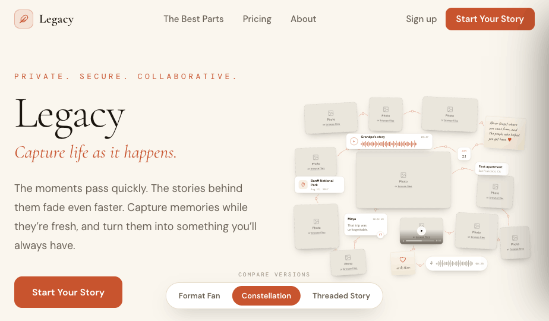

# Pass 1 — Foundations: colours, fonts, borders

**Goal:** get the Legacy palette, type, and border language exactly right on the lander **and** the Story chat widget. This pass is intentionally style-only. Sign it off before any structural work — the widget inherits these tokens, so if they're right the widget lands.

### Target look

---

## 1. Colour tokens (canonical)

These are the exact values used throughout the source of truth (`:root` in the HTML). In the app they map onto the **Legacy brand tokens** (scoped by `data-brand="legacy"` in `app/legacy/globals.css`) and the semantic Tailwind tokens the components already use.

| Prototype var | Hex / value | Role | App Tailwind token |
|---|---|---|---|
| `--hl-bg` | `#FAF6EE` | Page background (egg-shell) | `background` → `bg-background` |
| `--hl-bg-2` | `#F2ECDF` | Alt background band | (add if needed) |
| `--hl-surface` | `#FFFFFF` | Cards, popovers, user bubble | `surface` → `bg-surface` |
| `--hl-surface-2` | `#F4EFE5` | **Chat sidebar**, insets | secondary surface (add token) |
| `--hl-accent` | `#C8542E` | Terracotta accent (CTAs, icons, links) | `accent` → `bg-accent` |
| `--hl-accent-hover` | `#A93F1D` | Accent hover | `accent-hover` → `hover:bg-accent-hover` |
| `--hl-accent-soft` | `color-mix(in srgb, #C8542E 13%, transparent)` | Soft accent fill (icon tiles, chips) | `accent/10`–`/15` |
| `--hl-accent-line` | `color-mix(in srgb, #C8542E 30%, transparent)` | Accent-tinted hairline/borders | `accent/30` |
| `--hl-text` | `#1A150F` | Primary text (near-black, warm) | `text-primary` → `text-text-primary` |
| `--hl-muted` | `#6B6256` | Secondary/body-muted text | `text-muted` → `text-text-muted` |
| `--hl-faint` | `#9A917F` | Faint text (mono captions, placeholders) | `text-faint` (or `text-text-muted/70`) |
| `--hl-border` | `#E6DCC8` | Warm hairline border | `border` → `border-border` |
| `--hl-border-strong` | `color-mix(in srgb, #C8542E 42%, transparent)` | Emphasised border | `accent/40` |
| `--hl-on-accent` | `#FFFFFF` | Text/icons on accent | `background` → `text-background` |
| `--hl-shadow` | `rgba(26,21,15,0.30)` | Shadow base tint | — |
| `--hl-glow-1 / -2` | `#F2E7CF` / `#ECE0C6` | Radial glow (final CTA only) | — |

**Action:** set the Legacy brand token values in `app/legacy/globals.css` to these exact hexes. Because the chat shell (`components/shells/membership/`) already uses `bg-background / bg-surface / bg-accent / border-border / text-text-primary / text-text-muted`, wiring these correctly is what makes the widget render in the terracotta palette instead of the eggshell/gold it came through as last time.

> ⚠️ The broken preview was `?preview=heirloom`. Whichever brand scope the widget renders under for Legacy, its resolved token values must equal the table above. Verify the *computed* colours, not just that a token name exists.

---

## 2. Typography

Already wired via `next/font` in `app/legacy/layout.tsx` — just confirm usage.

| Token | Family | Where |
|---|---|---|
| `--font-display` | **Cormorant Garamond** (300/400/500/600, incl. italic) | H1/H2/H3, the chat empty-state headline, book cover, big display numerals |
| `--font-body` | **DM Sans** (400/500/600/700) | Body copy, buttons, chat bubbles, sidebar rows |
| `--font-mono` | **DM Mono** (400/500) | Eyebrows, captions, timestamps, tags — **UPPERCASE, letter-spacing .16–.34em** |
| `--font-hand` | **Caveat** (400/500/600) | **Hero only** — the handwritten note & doodle cards. Add to `next/font`. |

Type conventions to preserve:
- **Eyebrows / labels:** DM Mono, ~11–13px, `text-transform: uppercase`, `letter-spacing: .16em–.34em`, colour `accent` (or `faint` for section labels).
- **Display headings:** Cormorant, `font-weight: 300` for large H1/H2 (e.g. hero "Legacy", "What's a story worth keeping?"), `500` for smaller H3s; tight tracking `-.01em`.
- **Body:** DM Sans 400–500, line-height ~1.6.

---

## 3. Borders, radii, shadows

| Element | Value |
|---|---|
| Hairline border | `1px solid var(--hl-border)` (`#E6DCC8`); accent-tinted variant `1px solid var(--hl-accent-line)` |
| Card radius | `16px` (feature cards) · `18–20px` (large cards) · `24px` (hero/centre panels) |
| Pill / chip / tag | `999px` |
| Button radius | `10–13px` |
| Icon tile | `11–15px`, fill `--hl-accent-soft`, icon colour `--hl-accent` |
| Soft card shadow | `0 14px 30px -16px var(--hl-shadow), 0 1px 3px rgba(26,21,15,.06)` |
| Photo shadow | `0 18px 34px -14px var(--hl-shadow), 0 2px 6px -2px rgba(26,21,15,.18)` |
| Focus ring | 2px `accent` |

---

## 4. Chat widget — exact colour/type/border spec

*(Colours only — behaviour already exists. Reference: `chat-widget.jsx`.)* The drawer must read as the terracotta Legacy palette:

- **Drawer surface:** `background` (`#FAF6EE`). Shadow on the left edge `-30px 0 80px -30px rgba(26,21,15,.6)`. Backdrop `rgba(26,21,15,.5)` + `blur(4px)`.
- **Header (h52, border-bottom `border`):** title "Your Story" — DM Sans 600 15.5px `text-primary` + chevron `muted`; icon buttons `muted` → hover `text-primary` on `text-primary/8` bg, radius 9.
- **Sidebar:** background `surface-2` (`#F4EFE5`), right border `border`. Section labels DM Mono uppercase `.16em` `faint`. Rows DM Sans 14 `text-primary`, hover `text-primary/6`; active row bg `accent/12`, weight 600. "New chat" pen icon + writing-prompt icons in `accent`. Starred icon `accent` filled.
- **Empty state:** feather icon `accent`; headline **Cormorant 300, clamp(30–42px)**, `text-primary`, tracking `-.01em`; subcopy DM Sans 16 `muted`.
- **Message bubbles:** user = `surface` bg + `1px border`, radius 18 / bottom-right 5; assistant = **transparent**, `text-primary`, radius 18 / bottom-left 5. Assistant avatar = `accent` circle 32px with `on-accent` feather. Typing dots = `faint`.
- **Composer:** `surface` bg, `1px border`, radius 22, soft shadow; `+` and mic buttons `muted`; send button = `accent` circle (disabled = `accent/30`), arrow `on-accent`. Placeholder `faint`. Source-menu popover = `surface`, `border`, radius 16, rows with `accent` icons.
- **"Save this chat" button:** `accent` bg, `on-accent` text, radius 11, bookmark icon.
- **Toast:** `surface` + `border`, pill, check icon `accent`, DM Mono uppercase label.

---

## ✅ Pass 1 acceptance checklist
- [ ] Page background samples `#FAF6EE`; cards `#FFFFFF`; primary text `#1A150F`; hairlines `#E6DCC8`; every accent (buttons, icons, links, eyebrows) `#C8542E`, hover `#A93F1D`.
- [ ] Headings render in **Cormorant Garamond**; body in **DM Sans**; eyebrows/captions in **DM Mono** uppercase with wide tracking.
- [ ] Default `a` / `a:hover` colours use `accent` / `accent-hover` (no browser-blue links).
- [ ] Chat drawer opens in the **terracotta** palette: cream sidebar (`#F4EFE5`), white user bubbles with hairline, transparent assistant bubbles, `accent` feather avatar, **Cormorant** "What's a story worth keeping?" empty state.
- [ ] Radii/borders match the table (card 16–24, pills 999, composer 22, hairline 1px `#E6DCC8`).
- [ ] Side-by-side with `Heirloom_Combined Lander v2.html` (Constellation mode) at the same width shows no colour/type drift.
