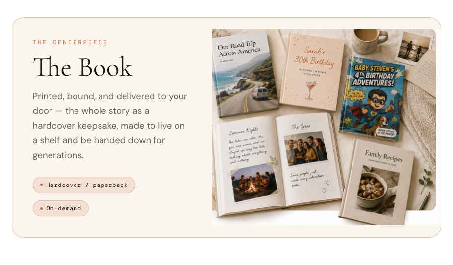

# Pass 4 — The Book section photo

**Goal:** replace the flat CSS "book cover" in the **"It becomes a book"** centrepiece with the **finished-books photograph** — a full-bleed lifestyle shot of real Legacy books on linen — while keeping the left copy column ("The Centerpiece / The Book / Printed, bound… / Hardcover · On-demand") exactly as it is.

**Reference:** `Heirloom_Combined Lander v2.html` → the "It becomes a book" section, `book-feature` card. Photo asset: `book-keepsake.png` in this bundle.

### Target look

> Scope is the **centrepiece card only**. The "Other ways to share it" cards below (Comic / Webpage / Audiobook / Time Capsule) are unchanged — do not touch them.

---

## Layout
The centrepiece is a rounded card (`border-radius: 24`, `1px solid var(--hl-accent-line)`, `overflow: hidden`) laid out as a **2-column grid**, `alignItems: center`:

- **Left cell** (`~1fr`, padded `clamp(30px,4.5vw,60px)`, flex column centred): the existing copy — eyebrow "THE CENTERPIECE" (DM Mono), "The Book" (Cormorant), the paragraph, and the two chips "Hardcover / paperback" · "On-demand".
- **Right cell** (`~1.15fr`): the photograph as a plain `` / `next/image`, `width: 100%`, **`height: auto` (natural aspect)** — **not** `object-fit: cover`. Showing the full composition avoids clipping the book titles (an earlier attempt cover-cropped "Our Road Trip" — don't). The card's `overflow: hidden` + `border-radius: 24` rounds the photo's right corners; its left edge sits flush against the copy.

**Responsive:** below **820px** the grid collapses to one column (copy above, photo below, full width).

---

## The image
- Ship `book-keepsake.png` (in this bundle) to `public/legacy/` and render with `next/image`. It is a **placeholder-grade AI render** — fine for launch, but treat it as swappable for real product photography later (same slot, no layout change).
- The photo already contains its own composition (road-trip memoir, 30th-birthday book, a kids' comic, an open photo spread, a family-recipe book, coffee, letters, linen). **Don't** overlay text on it.
- Alt: *"Finished Legacy books on a linen table — a road-trip memoir, a birthday keepsake, a kids' comic, a family recipe book, and an open photo spread."*
- A slim cream band above/below the photo (from `alignItems: center`) is intentional matting — acceptable. If you prefer edge-to-edge, stretch the right cell and use `object-fit: cover` with a **wide** cell so only top/bottom crop (never the left/right, which holds the book titles).

---

## ✅ Pass 4 acceptance checklist
- [ ] Centrepiece card shows the finished-books photograph on the right, bleeding to the rounded right corners of the card.
- [ ] Left copy (eyebrow, "The Book", paragraph, both chips) is unchanged and vertically centred beside the photo.
- [ ] **No book title is clipped** — the full composition is visible (natural aspect, or wide cover crop).
- [ ] Below 820px the section stacks (copy, then full-width photo).
- [ ] The "Other ways to share it" cards below are untouched.
- [ ] Photo served via `next/image`; asset is swappable for real photography without layout change.
